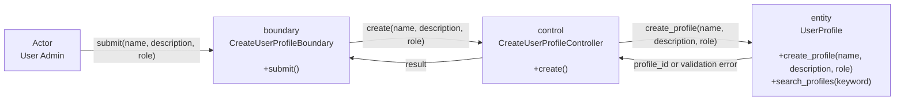
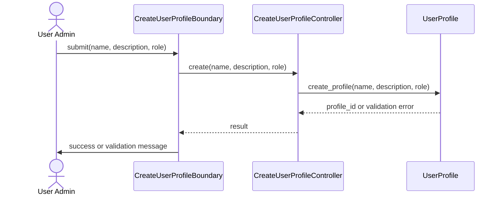

# User Story 1: Create User Profile

## BCE Diagram

```mermaid
flowchart LR
    N0["Actor<br/>User Admin"]
    N1["boundary<br/>CreateUserProfileBoundary<br/><br/>+submit()"]
    N2["control<br/>CreateUserProfileController<br/><br/>+create()"]
    N3["entity<br/>UserProfile<br/><br/>+create_profile(name, description, role)<br/>+search_profiles(keyword)"]
    N0 -->|"submit(name, description, role)"| N1
    N1 -->|"create(name, description, role)"| N2
    N2 -->|"create_profile(name, description, role)"| N3
    N3 -->|"profile_id or validation error"| N2
    N2 -->|"result"| N1
```

## Sequence Diagram

```mermaid
sequenceDiagram
    actor P0 as User Admin
    participant P1 as CreateUserProfileBoundary
    participant P2 as CreateUserProfileController
    participant P3 as UserProfile
    P0->>P1: submit(name, description, role)
    P1->>P2: create(name, description, role)
    P2->>P3: create_profile(name, description, role)
    P3-->>P2: profile_id or validation error
    P2-->>P1: result
    P1->>P0: success or validation message
```
