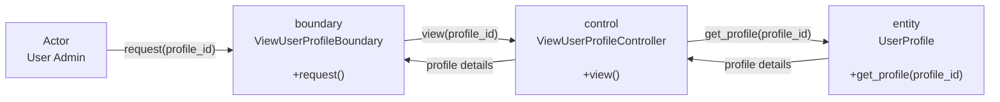
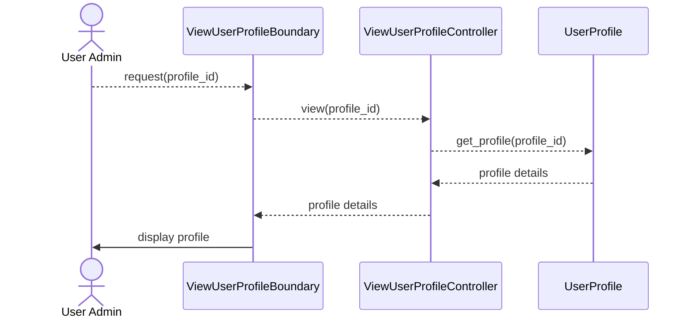

# User Story 2: View User Profile

## BCE Diagram

```mermaid
flowchart LR
    N0["Actor<br/>User Admin"]
    N1["boundary<br/>ViewUserProfileBoundary<br/><br/>+request()"]
    N2["control<br/>ViewUserProfileController<br/><br/>+view()"]
    N3["entity<br/>UserProfile<br/><br/>+get_profile(profile_id)"]
    N0 -->|"request(profile_id)"| N1
    N1 -->|"view(profile_id)"| N2
    N2 -->|"get_profile(profile_id)"| N3
    N3 -->|"profile details"| N2
    N2 -->|"profile details"| N1
```

## Sequence Diagram

```mermaid
sequenceDiagram
    actor P0 as User Admin
    participant P1 as ViewUserProfileBoundary
    participant P2 as ViewUserProfileController
    participant P3 as UserProfile
    P0-->>P1: request(profile_id)
    P1-->>P2: view(profile_id)
    P2-->>P3: get_profile(profile_id)
    P3-->>P2: profile details
    P2-->>P1: profile details
    P1->>P0: display profile
```
