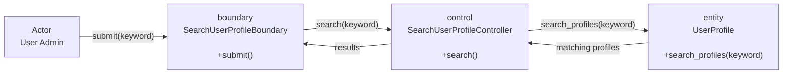
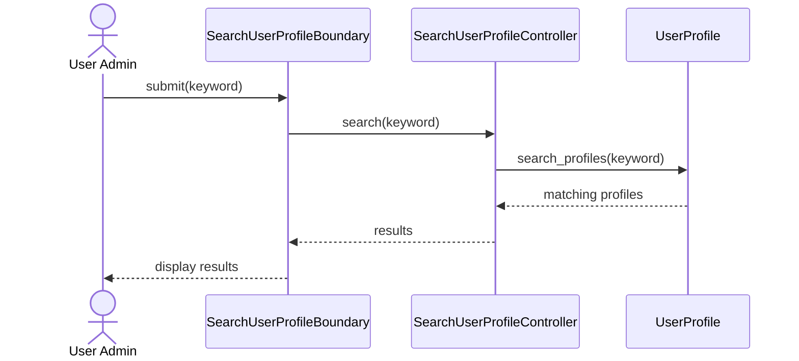

# User Story 5: Search User Profiles

## BCE Diagram

```mermaid
flowchart LR
    N0["Actor<br/>User Admin"]
    N1["boundary<br/>SearchUserProfileBoundary<br/><br/>+submit()"]
    N2["control<br/>SearchUserProfileController<br/><br/>+search()"]
    N3["entity<br/>UserProfile<br/><br/>+search_profiles(keyword)"]
    N0 -->|"submit(keyword)"| N1
    N1 -->|"search(keyword)"| N2
    N2 -->|"search_profiles(keyword)"| N3
    N3 -->|"matching profiles"| N2
    N2 -->|"results"| N1
```

## Sequence Diagram

```mermaid
sequenceDiagram
    actor P0 as User Admin
    participant P1 as SearchUserProfileBoundary
    participant P2 as SearchUserProfileController
    participant P3 as UserProfile
    P0->>P1: submit(keyword)
    P1->>P2: search(keyword)
    P2->>P3: search_profiles(keyword)
    P3-->>P2: matching profiles
    P2-->>P1: results
    P1-->>P0: display results
```
