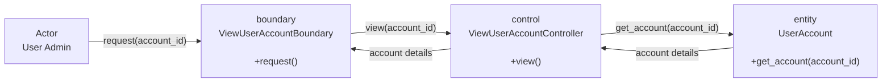
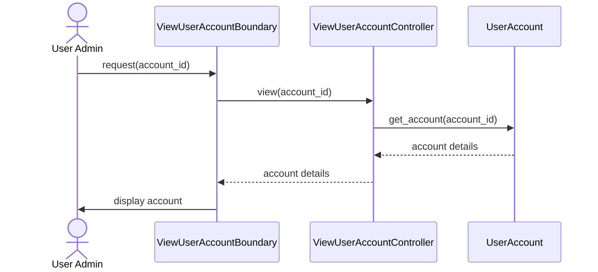

# User Story 7: View User Account

## BCE Diagram

```mermaid
flowchart LR
    N0["Actor<br/>User Admin"]
    N1["boundary<br/>ViewUserAccountBoundary<br/><br/>+request()"]
    N2["control<br/>ViewUserAccountController<br/><br/>+view()"]
    N3["entity<br/>UserAccount<br/><br/>+get_account(account_id)"]
    N0 -->|"request(account_id)"| N1
    N1 -->|"view(account_id)"| N2
    N2 -->|"get_account(account_id)"| N3
    N3 -->|"account details"| N2
    N2 -->|"account details"| N1
```

## Sequence Diagram

```mermaid
sequenceDiagram
    actor P0 as User Admin
    participant P1 as ViewUserAccountBoundary
    participant P2 as ViewUserAccountController
    participant P3 as UserAccount
    P0->>P1: request(account_id)
    P1->>P2: view(account_id)
    P2->>P3: get_account(account_id)
    P3-->>P2: account details
    P2-->>P1: account details
    P1->>P0: display account
```
