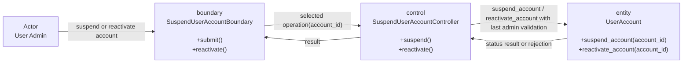
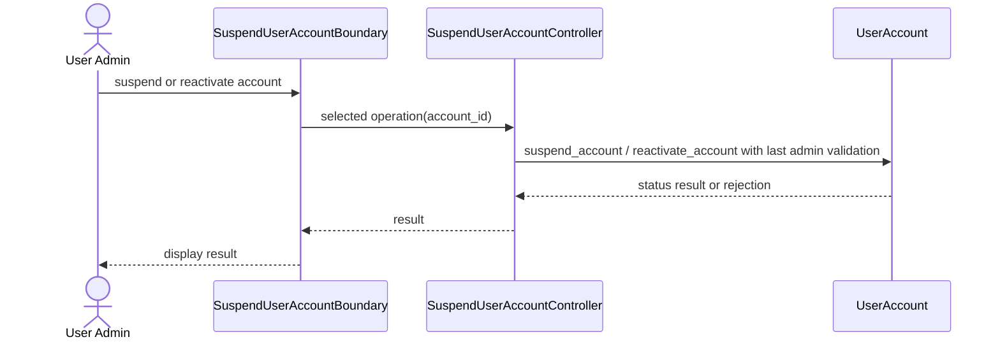

# User Story 9: Manage User Account Status

## BCE Diagram

```mermaid
flowchart LR
    N0["Actor<br/>User Admin"]
    N1["boundary<br/>SuspendUserAccountBoundary<br/><br/>+submit()<br/>+reactivate()"]
    N2["control<br/>SuspendUserAccountController<br/><br/>+suspend()<br/>+reactivate()"]
    N3["entity<br/>UserAccount<br/><br/>+suspend_account(account_id)<br/>+reactivate_account(account_id)"]
    N0 -->|"suspend or reactivate account"| N1
    N1 -->|"selected operation(account_id)"| N2
    N2 -->|"suspend_account / reactivate_account with last admin validation"| N3
    N3 -->|"status result or rejection"| N2
    N2 -->|"result"| N1
```

## Sequence Diagram

```mermaid
sequenceDiagram
    actor P0 as User Admin
    participant P1 as SuspendUserAccountBoundary
    participant P2 as SuspendUserAccountController
    participant P3 as UserAccount
    P0->>P1: suspend or reactivate account
    P1->>P2: selected operation(account_id)
    P2->>P3: suspend_account / reactivate_account with last admin validation
    P3-->>P2: status result or rejection
    P2-->>P1: result
    P1-->>P0: display result
```
