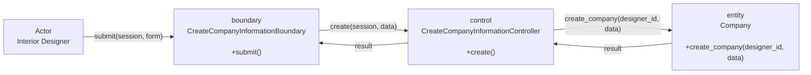
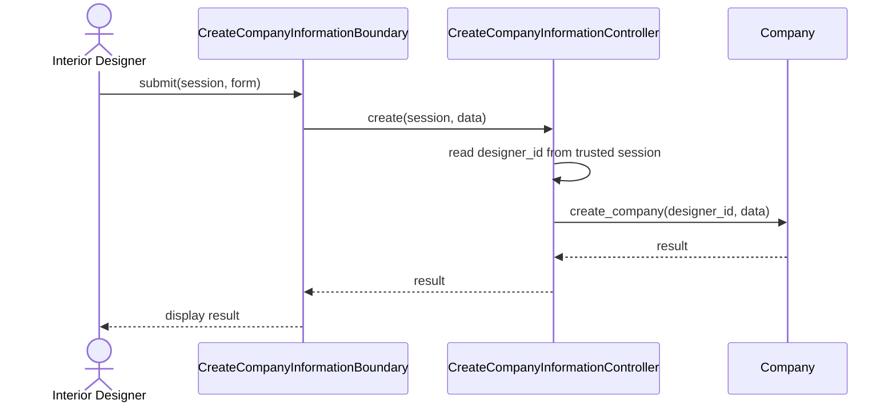

# User Story 13: Create Company Information

## BCE Diagram

```mermaid
flowchart LR
    N0["Actor<br/>Interior Designer"]
    N1["boundary<br/>CreateCompanyInformationBoundary<br/><br/>+submit()"]
    N2["control<br/>CreateCompanyInformationController<br/><br/>+create()"]
    N3["entity<br/>Company<br/><br/>+create_company(designer_id, data)"]
    N0 -->|"submit(session, form)"| N1
    N1 -->|"create(session, data)"| N2
    N2 -->|"create_company(designer_id, data)"| N3
    N3 -->|"result"| N2
    N2 -->|"result"| N1
```

## Sequence Diagram

```mermaid
sequenceDiagram
    actor P0 as Interior Designer
    participant P1 as CreateCompanyInformationBoundary
    participant P2 as CreateCompanyInformationController
    participant P3 as Company
    P0->>P1: submit(session, form)
    P1->>P2: create(session, data)
    P2->>P2: read designer_id from trusted session
    P2->>P3: create_company(designer_id, data)
    P3-->>P2: result
    P2-->>P1: result
    P1-->>P0: display result
```
