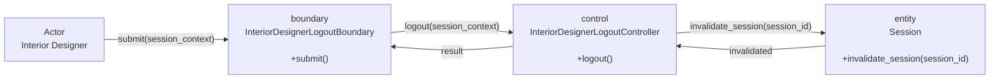
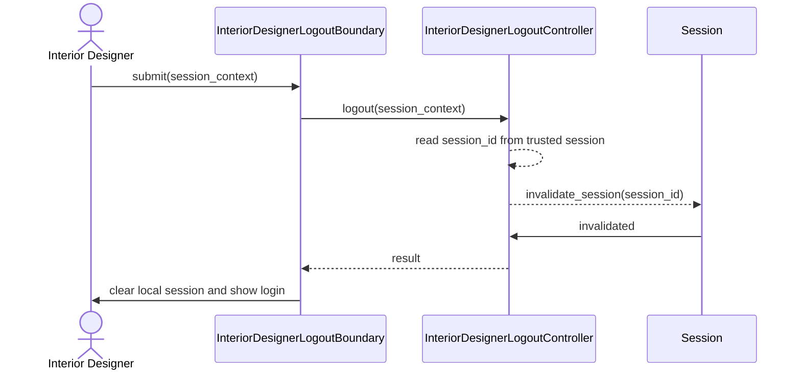

# User Story 19: Interior Designer Logout

## BCE Diagram

```mermaid
flowchart LR
    N0["Actor<br/>Interior Designer"]
    N1["boundary<br/>InteriorDesignerLogoutBoundary<br/><br/>+submit()"]
    N2["control<br/>InteriorDesignerLogoutController<br/><br/>+logout()"]
    N3["entity<br/>Session<br/><br/>+invalidate_session(session_id)"]
    N0 -->|"submit(session_context)"| N1
    N1 -->|"logout(session_context)"| N2
    N2 -->|"invalidate_session(session_id)"| N3
    N3 -->|"invalidated"| N2
    N2 -->|"result"| N1
```

## Sequence Diagram

```mermaid
sequenceDiagram
    actor P0 as Interior Designer
    participant P1 as InteriorDesignerLogoutBoundary
    participant P2 as InteriorDesignerLogoutController
    participant P3 as Session
    P0->>P1: submit(session_context)
    P1->>P2: logout(session_context)
    P2-->>P2: read session_id from trusted session
    P2-->>P3: invalidate_session(session_id)
    P3->>P2: invalidated
    P2-->>P1: result
    P1->>P0: clear local session and show login
```
