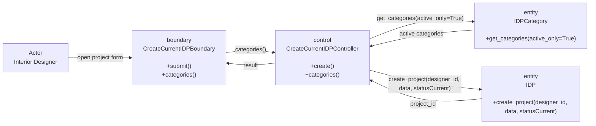
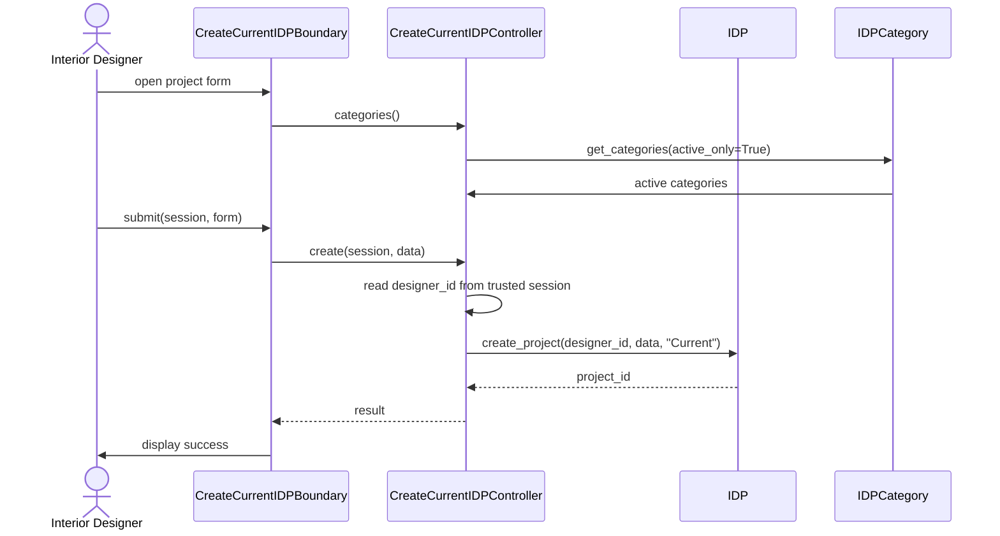

# User Story 20: Create Current IDP

## BCE Diagram

```mermaid
flowchart LR
    N0["Actor<br/>Interior Designer"]
    N1["boundary<br/>CreateCurrentIDPBoundary<br/><br/>+submit()<br/>+categories()"]
    N2["control<br/>CreateCurrentIDPController<br/><br/>+create()<br/>+categories()"]
    N3["entity<br/>IDP<br/><br/>+create_project(designer_id, data, statusCurrent)"]
    N4["entity<br/>IDPCategory<br/><br/>+get_categories(active_only=True)"]
    N0 -->|"open project form"| N1
    N1 -->|"categories()"| N2
    N2 -->|"get_categories(active_only=True)"| N4
    N4 -->|"active categories"| N2
    N2 -->|"create_project(designer_id, data, statusCurrent)"| N3
    N3 -->|"project_id"| N2
    N2 -->|"result"| N1
```

## Sequence Diagram

```mermaid
sequenceDiagram
    actor P0 as Interior Designer
    participant P1 as CreateCurrentIDPBoundary
    participant P2 as CreateCurrentIDPController
    participant P3 as IDP
    participant P4 as IDPCategory
    P0->>P1: open project form
    P1->>P2: categories()
    P2->>P4: get_categories(active_only=True)
    P4->>P2: active categories
    P0->>P1: submit(session, form)
    P1->>P2: create(session, data)
    P2->>P2: read designer_id from trusted session
    P2->>P3: create_project(designer_id, data, "Current")
    P3-->>P2: project_id
    P2-->>P1: result
    P1->>P0: display success
```
