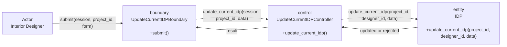
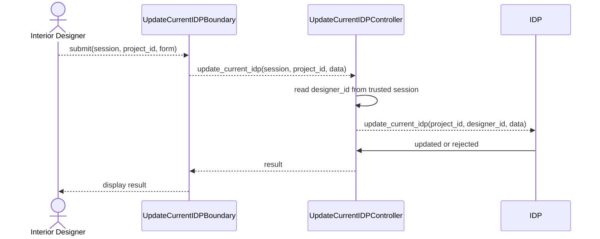

# User Story 22: Update Current IDP

## BCE Diagram

```mermaid
flowchart LR
    N0["Actor<br/>Interior Designer"]
    N1["boundary<br/>UpdateCurrentIDPBoundary<br/><br/>+submit()"]
    N2["control<br/>UpdateCurrentIDPController<br/><br/>+update_current_idp()"]
    N3["entity<br/>IDP<br/><br/>+update_current_idp(project_id, designer_id, data)"]
    N0 -->|"submit(session, project_id, form)"| N1
    N1 -->|"update_current_idp(session, project_id, data)"| N2
    N2 -->|"update_current_idp(project_id, designer_id, data)"| N3
    N3 -->|"updated or rejected"| N2
    N2 -->|"result"| N1
```

## Sequence Diagram

```mermaid
sequenceDiagram
    actor P0 as Interior Designer
    participant P1 as UpdateCurrentIDPBoundary
    participant P2 as UpdateCurrentIDPController
    participant P3 as IDP
    P0-->>P1: submit(session, project_id, form)
    P1-->>P2: update_current_idp(session, project_id, data)
    P2->>P2: read designer_id from trusted session
    P2-->>P3: update_current_idp(project_id, designer_id, data)
    P3->>P2: updated or rejected
    P2-->>P1: result
    P1-->>P0: display result
```
