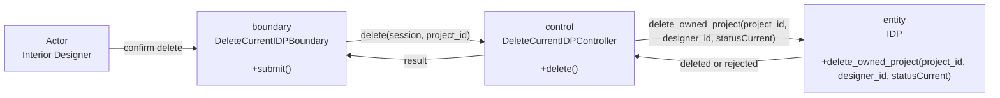
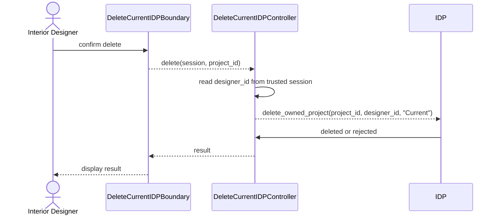

# User Story 23: Delete Current IDP

## BCE Diagram

```mermaid
flowchart LR
    N0["Actor<br/>Interior Designer"]
    N1["boundary<br/>DeleteCurrentIDPBoundary<br/><br/>+submit()"]
    N2["control<br/>DeleteCurrentIDPController<br/><br/>+delete()"]
    N3["entity<br/>IDP<br/><br/>+delete_owned_project(project_id, designer_id, statusCurrent)"]
    N0 -->|"confirm delete"| N1
    N1 -->|"delete(session, project_id)"| N2
    N2 -->|"delete_owned_project(project_id, designer_id, statusCurrent)"| N3
    N3 -->|"deleted or rejected"| N2
    N2 -->|"result"| N1
```

## Sequence Diagram

```mermaid
sequenceDiagram
    actor P0 as Interior Designer
    participant P1 as DeleteCurrentIDPBoundary
    participant P2 as DeleteCurrentIDPController
    participant P3 as IDP
    P0->>P1: confirm delete
    P1-->>P2: delete(session, project_id)
    P2->>P2: read designer_id from trusted session
    P2-->>P3: delete_owned_project(project_id, designer_id, "Current")
    P3->>P2: deleted or rejected
    P2-->>P1: result
    P1-->>P0: display result
```
