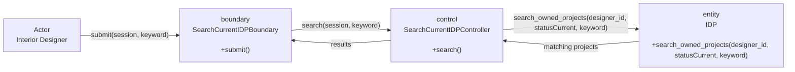
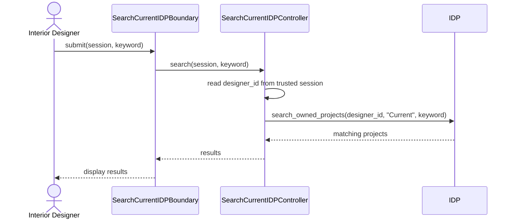

# User Story 24: Search Current IDPs

## BCE Diagram

```mermaid
flowchart LR
    N0["Actor<br/>Interior Designer"]
    N1["boundary<br/>SearchCurrentIDPBoundary<br/><br/>+submit()"]
    N2["control<br/>SearchCurrentIDPController<br/><br/>+search()"]
    N3["entity<br/>IDP<br/><br/>+search_owned_projects(designer_id, statusCurrent, keyword)"]
    N0 -->|"submit(session, keyword)"| N1
    N1 -->|"search(session, keyword)"| N2
    N2 -->|"search_owned_projects(designer_id, statusCurrent, keyword)"| N3
    N3 -->|"matching projects"| N2
    N2 -->|"results"| N1
```

## Sequence Diagram

```mermaid
sequenceDiagram
    actor P0 as Interior Designer
    participant P1 as SearchCurrentIDPBoundary
    participant P2 as SearchCurrentIDPController
    participant P3 as IDP
    P0->>P1: submit(session, keyword)
    P1->>P2: search(session, keyword)
    P2->>P2: read designer_id from trusted session
    P2->>P3: search_owned_projects(designer_id, "Current", keyword)
    P3-->>P2: matching projects
    P2-->>P1: results
    P1-->>P0: display results
```
