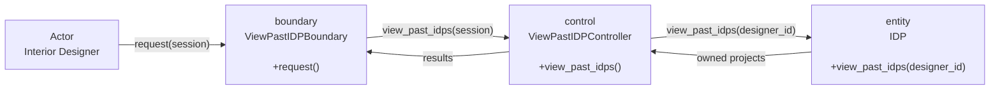
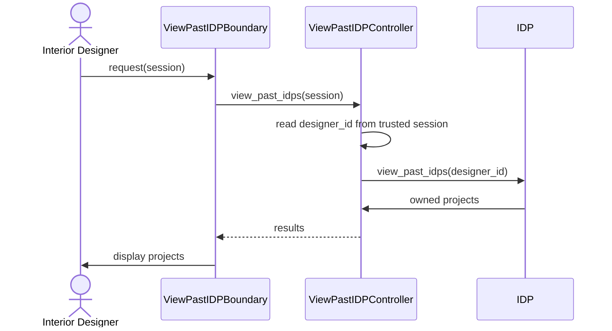

# User Story 26: View Past IDPs

## BCE Diagram

```mermaid
flowchart LR
    N0["Actor<br/>Interior Designer"]
    N1["boundary<br/>ViewPastIDPBoundary<br/><br/>+request()"]
    N2["control<br/>ViewPastIDPController<br/><br/>+view_past_idps()"]
    N3["entity<br/>IDP<br/><br/>+view_past_idps(designer_id)"]
    N0 -->|"request(session)"| N1
    N1 -->|"view_past_idps(session)"| N2
    N2 -->|"view_past_idps(designer_id)"| N3
    N3 -->|"owned projects"| N2
    N2 -->|"results"| N1
```

## Sequence Diagram

```mermaid
sequenceDiagram
    actor P0 as Interior Designer
    participant P1 as ViewPastIDPBoundary
    participant P2 as ViewPastIDPController
    participant P3 as IDP
    P0->>P1: request(session)
    P1->>P2: view_past_idps(session)
    P2->>P2: read designer_id from trusted session
    P2->>P3: view_past_idps(designer_id)
    P3->>P2: owned projects
    P2-->>P1: results
    P1->>P0: display projects
```
