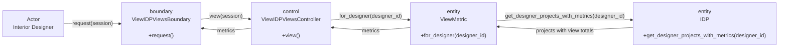
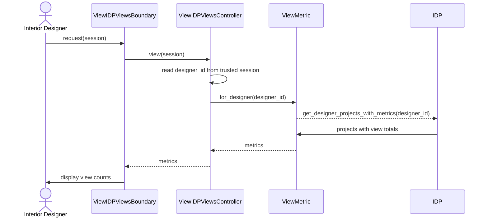

# User Story 37: View IDP View Count

## BCE Diagram

```mermaid
flowchart LR
    N0["Actor<br/>Interior Designer"]
    N1["boundary<br/>ViewIDPViewsBoundary<br/><br/>+request()"]
    N2["control<br/>ViewIDPViewsController<br/><br/>+view()"]
    N3["entity<br/>ViewMetric<br/><br/>+for_designer(designer_id)"]
    N4["entity<br/>IDP<br/><br/>+get_designer_projects_with_metrics(designer_id)"]
    N0 -->|"request(session)"| N1
    N1 -->|"view(session)"| N2
    N2 -->|"for_designer(designer_id)"| N3
    N3 -->|"get_designer_projects_with_metrics(designer_id)"| N4
    N4 -->|"projects with view totals"| N3
    N3 -->|"metrics"| N2
    N2 -->|"metrics"| N1
```

## Sequence Diagram

```mermaid
sequenceDiagram
    actor P0 as Interior Designer
    participant P1 as ViewIDPViewsBoundary
    participant P2 as ViewIDPViewsController
    participant P3 as ViewMetric
    participant P4 as IDP
    P0->>P1: request(session)
    P1->>P2: view(session)
    P2->>P2: read designer_id from trusted session
    P2->>P3: for_designer(designer_id)
    P3-->>P4: get_designer_projects_with_metrics(designer_id)
    P4->>P3: projects with view totals
    P3-->>P2: metrics
    P2-->>P1: metrics
    P1->>P0: display view counts
```
