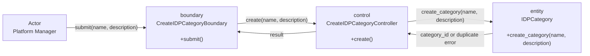
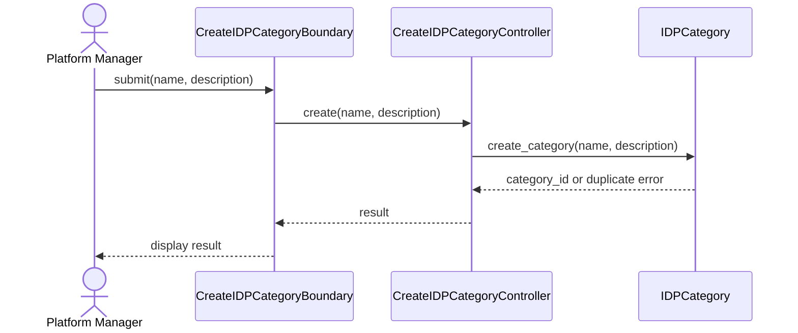

# User Story 39: Create IDP Category

## BCE Diagram

```mermaid
flowchart LR
    N0["Actor<br/>Platform Manager"]
    N1["boundary<br/>CreateIDPCategoryBoundary<br/><br/>+submit()"]
    N2["control<br/>CreateIDPCategoryController<br/><br/>+create()"]
    N3["entity<br/>IDPCategory<br/><br/>+create_category(name, description)"]
    N0 -->|"submit(name, description)"| N1
    N1 -->|"create(name, description)"| N2
    N2 -->|"create_category(name, description)"| N3
    N3 -->|"category_id or duplicate error"| N2
    N2 -->|"result"| N1
```

## Sequence Diagram

```mermaid
sequenceDiagram
    actor P0 as Platform Manager
    participant P1 as CreateIDPCategoryBoundary
    participant P2 as CreateIDPCategoryController
    participant P3 as IDPCategory
    P0->>P1: submit(name, description)
    P1->>P2: create(name, description)
    P2->>P3: create_category(name, description)
    P3-->>P2: category_id or duplicate error
    P2-->>P1: result
    P1-->>P0: display result
```
