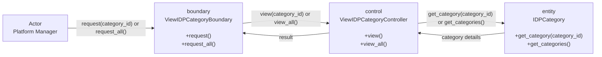
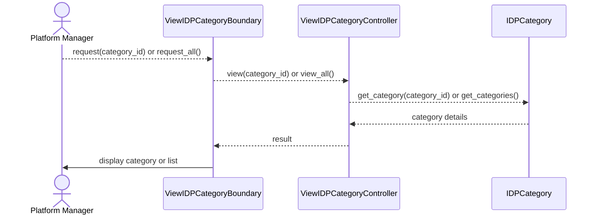

# User Story 40: View IDP Category

## BCE Diagram

```mermaid
flowchart LR
    N0["Actor<br/>Platform Manager"]
    N1["boundary<br/>ViewIDPCategoryBoundary<br/><br/>+request()<br/>+request_all()"]
    N2["control<br/>ViewIDPCategoryController<br/><br/>+view()<br/>+view_all()"]
    N3["entity<br/>IDPCategory<br/><br/>+get_category(category_id)<br/>+get_categories()"]
    N0 -->|"request(category_id) or request_all()"| N1
    N1 -->|"view(category_id) or view_all()"| N2
    N2 -->|"get_category(category_id) or get_categories()"| N3
    N3 -->|"category details"| N2
    N2 -->|"result"| N1
```

## Sequence Diagram

```mermaid
sequenceDiagram
    actor P0 as Platform Manager
    participant P1 as ViewIDPCategoryBoundary
    participant P2 as ViewIDPCategoryController
    participant P3 as IDPCategory
    P0-->>P1: request(category_id) or request_all()
    P1-->>P2: view(category_id) or view_all()
    P2-->>P3: get_category(category_id) or get_categories()
    P3-->>P2: category details
    P2-->>P1: result
    P1->>P0: display category or list
```
