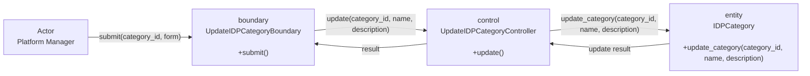
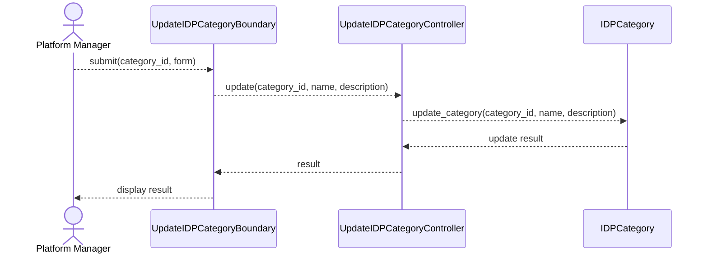

# User Story 41: Update IDP Category

## BCE Diagram

```mermaid
flowchart LR
    N0["Actor<br/>Platform Manager"]
    N1["boundary<br/>UpdateIDPCategoryBoundary<br/><br/>+submit()"]
    N2["control<br/>UpdateIDPCategoryController<br/><br/>+update()"]
    N3["entity<br/>IDPCategory<br/><br/>+update_category(category_id, name, description)"]
    N0 -->|"submit(category_id, form)"| N1
    N1 -->|"update(category_id, name, description)"| N2
    N2 -->|"update_category(category_id, name, description)"| N3
    N3 -->|"update result"| N2
    N2 -->|"result"| N1
```

## Sequence Diagram

```mermaid
sequenceDiagram
    actor P0 as Platform Manager
    participant P1 as UpdateIDPCategoryBoundary
    participant P2 as UpdateIDPCategoryController
    participant P3 as IDPCategory
    P0-->>P1: submit(category_id, form)
    P1-->>P2: update(category_id, name, description)
    P2-->>P3: update_category(category_id, name, description)
    P3-->>P2: update result
    P2-->>P1: result
    P1-->>P0: display result
```
