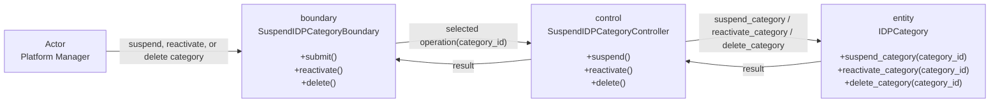
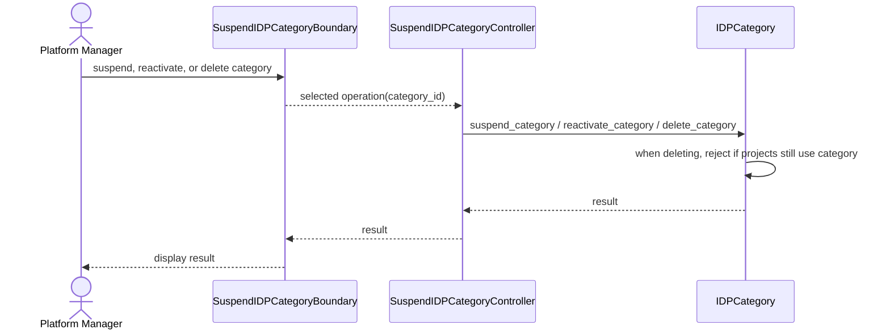

# User Story 42: Manage IDP Category Status

## BCE Diagram

```mermaid
flowchart LR
    N0["Actor<br/>Platform Manager"]
    N1["boundary<br/>SuspendIDPCategoryBoundary<br/><br/>+submit()<br/>+reactivate()<br/>+delete()"]
    N2["control<br/>SuspendIDPCategoryController<br/><br/>+suspend()<br/>+reactivate()<br/>+delete()"]
    N3["entity<br/>IDPCategory<br/><br/>+suspend_category(category_id)<br/>+reactivate_category(category_id)<br/>+delete_category(category_id)"]
    N0 -->|"suspend, reactivate, or delete category"| N1
    N1 -->|"selected operation(category_id)"| N2
    N2 -->|"suspend_category / reactivate_category / delete_category"| N3
    N3 -->|"result"| N2
    N2 -->|"result"| N1
```

## Sequence Diagram

```mermaid
sequenceDiagram
    actor P0 as Platform Manager
    participant P1 as SuspendIDPCategoryBoundary
    participant P2 as SuspendIDPCategoryController
    participant P3 as IDPCategory
    P0->>P1: suspend, reactivate, or delete category
    P1-->>P2: selected operation(category_id)
    P2->>P3: suspend_category / reactivate_category / delete_category
    P3->>P3: when deleting, reject if projects still use category
    P3-->>P2: result
    P2-->>P1: result
    P1-->>P0: display result
```
