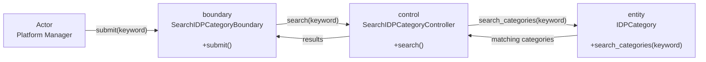
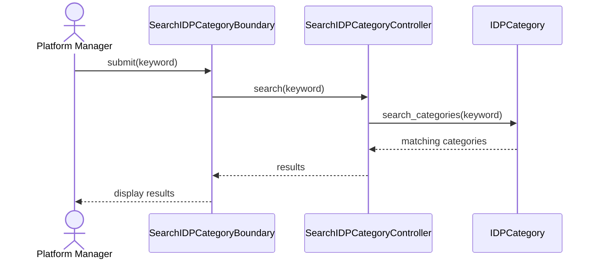

# User Story 43: Search IDP Categories

## BCE Diagram

```mermaid
flowchart LR
    N0["Actor<br/>Platform Manager"]
    N1["boundary<br/>SearchIDPCategoryBoundary<br/><br/>+submit()"]
    N2["control<br/>SearchIDPCategoryController<br/><br/>+search()"]
    N3["entity<br/>IDPCategory<br/><br/>+search_categories(keyword)"]
    N0 -->|"submit(keyword)"| N1
    N1 -->|"search(keyword)"| N2
    N2 -->|"search_categories(keyword)"| N3
    N3 -->|"matching categories"| N2
    N2 -->|"results"| N1
```

## Sequence Diagram

```mermaid
sequenceDiagram
    actor P0 as Platform Manager
    participant P1 as SearchIDPCategoryBoundary
    participant P2 as SearchIDPCategoryController
    participant P3 as IDPCategory
    P0->>P1: submit(keyword)
    P1->>P2: search(keyword)
    P2->>P3: search_categories(keyword)
    P3-->>P2: matching categories
    P2-->>P1: results
    P1-->>P0: display results
```
