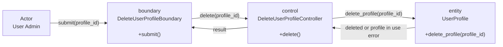
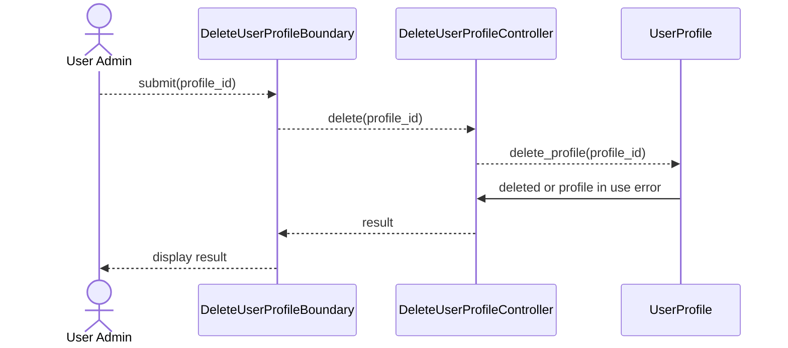

# User Story 49: Delete User Profile

## BCE Diagram

```mermaid
flowchart LR
    N0["Actor<br/>User Admin"]
    N1["boundary<br/>DeleteUserProfileBoundary<br/><br/>+submit()"]
    N2["control<br/>DeleteUserProfileController<br/><br/>+delete()"]
    N3["entity<br/>UserProfile<br/><br/>+delete_profile(profile_id)"]
    N0 -->|"submit(profile_id)"| N1
    N1 -->|"delete(profile_id)"| N2
    N2 -->|"delete_profile(profile_id)"| N3
    N3 -->|"deleted or profile in use error"| N2
    N2 -->|"result"| N1
```

## Sequence Diagram

```mermaid
sequenceDiagram
    actor P0 as User Admin
    participant P1 as DeleteUserProfileBoundary
    participant P2 as DeleteUserProfileController
    participant P3 as UserProfile
    P0-->>P1: submit(profile_id)
    P1-->>P2: delete(profile_id)
    P2-->>P3: delete_profile(profile_id)
    P3->>P2: deleted or profile in use error
    P2-->>P1: result
    P1-->>P0: display result
```
