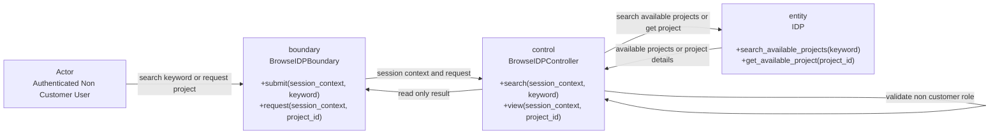
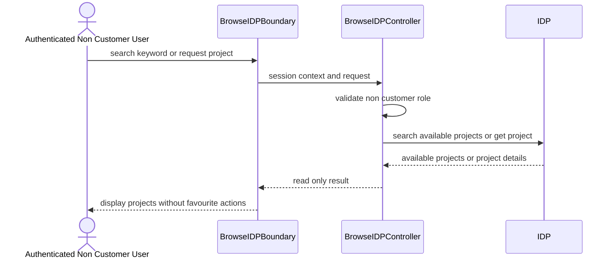

# User Story 50: Browse IDPs as Authenticated Non Customer

## BCE Diagram

```mermaid
flowchart LR
    N0["Actor<br/>Authenticated Non Customer User"]
    N1["boundary<br/>BrowseIDPBoundary<br/><br/>+submit(session_context, keyword)<br/>+request(session_context, project_id)"]
    N2["control<br/>BrowseIDPController<br/><br/>+search(session_context, keyword)<br/>+view(session_context, project_id)"]
    N3["entity<br/>IDP<br/><br/>+search_available_projects(keyword)<br/>+get_available_project(project_id)"]
    N0 -->|"search keyword or request project"| N1
    N1 -->|"session context and request"| N2
    N2 -->|"validate non customer role"| N2
    N2 -->|"search available projects or get project"| N3
    N3 -->|"available projects or project details"| N2
    N2 -->|"read only result"| N1
```

## Sequence Diagram

```mermaid
sequenceDiagram
    actor P0 as Authenticated Non Customer User
    participant P1 as BrowseIDPBoundary
    participant P2 as BrowseIDPController
    participant P3 as IDP
    P0->>P1: search keyword or request project
    P1->>P2: session context and request
    P2->>P2: validate non customer role
    P2->>P3: search available projects or get project
    P3-->>P2: available projects or project details
    P2-->>P1: read only result
    P1-->>P0: display projects without favourite actions
```
