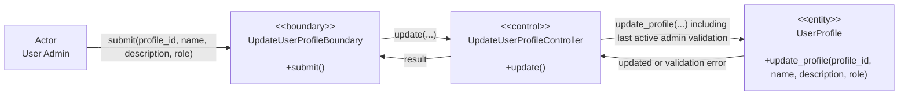
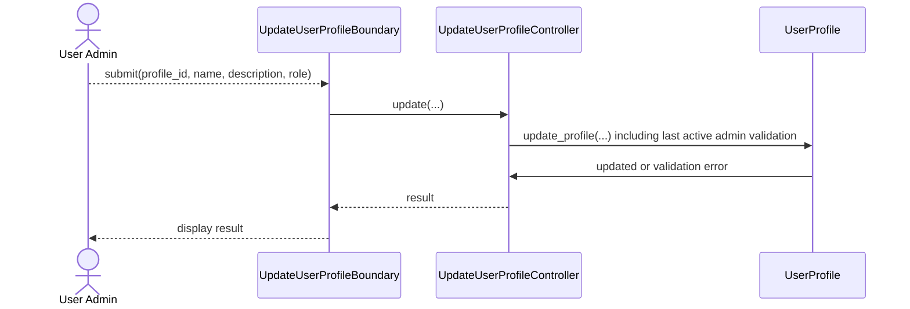

# User Story 3: Update User Profile

## BCE Diagram

```mermaid
flowchart LR
    N0["Actor<br/>User Admin"]
    N1["&lt;&lt;boundary&gt;&gt;<br/>UpdateUserProfileBoundary<br/><br/>+submit()"]
    N2["&lt;&lt;control&gt;&gt;<br/>UpdateUserProfileController<br/><br/>+update()"]
    N3["&lt;&lt;entity&gt;&gt;<br/>UserProfile<br/><br/>+update_profile(profile_id, name, description, role)"]
    N0 -->|"submit(profile_id, name, description, role)"| N1
    N1 -->|"update(...)"| N2
    N2 -->|"update_profile(...) including last active admin validation"| N3
    N3 -->|"updated or validation error"| N2
    N2 -->|"result"| N1
```

## Sequence Diagram

```mermaid
sequenceDiagram
    actor P0 as User Admin
    participant P1 as UpdateUserProfileBoundary
    participant P2 as UpdateUserProfileController
    participant P3 as UserProfile
    P0-->>P1: submit(profile_id, name, description, role)
    P1->>P2: update(...)
    P2->>P3: update_profile(...) including last active admin validation
    P3->>P2: updated or validation error
    P2-->>P1: result
    P1-->>P0: display result
```
