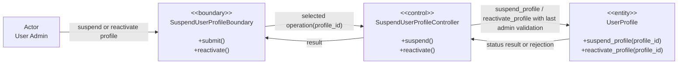
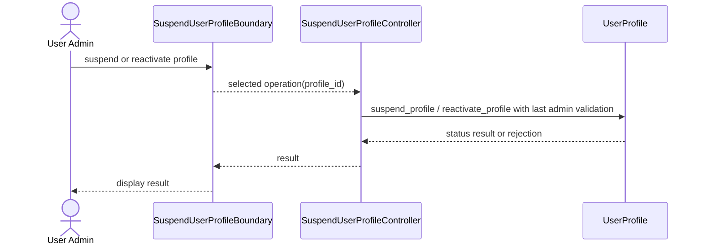

# User Story 4: Manage User Profile Status

## BCE Diagram

```mermaid
flowchart LR
    N0["Actor<br/>User Admin"]
    N1["&lt;&lt;boundary&gt;&gt;<br/>SuspendUserProfileBoundary<br/><br/>+submit()<br/>+reactivate()"]
    N2["&lt;&lt;control&gt;&gt;<br/>SuspendUserProfileController<br/><br/>+suspend()<br/>+reactivate()"]
    N3["&lt;&lt;entity&gt;&gt;<br/>UserProfile<br/><br/>+suspend_profile(profile_id)<br/>+reactivate_profile(profile_id)"]
    N0 -->|"suspend or reactivate profile"| N1
    N1 -->|"selected operation(profile_id)"| N2
    N2 -->|"suspend_profile / reactivate_profile with last admin validation"| N3
    N3 -->|"status result or rejection"| N2
    N2 -->|"result"| N1
```

## Sequence Diagram

```mermaid
sequenceDiagram
    actor P0 as User Admin
    participant P1 as SuspendUserProfileBoundary
    participant P2 as SuspendUserProfileController
    participant P3 as UserProfile
    P0->>P1: suspend or reactivate profile
    P1-->>P2: selected operation(profile_id)
    P2->>P3: suspend_profile / reactivate_profile with last admin validation
    P3-->>P2: status result or rejection
    P2-->>P1: result
    P1-->>P0: display result
```
