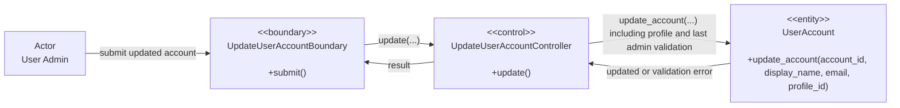
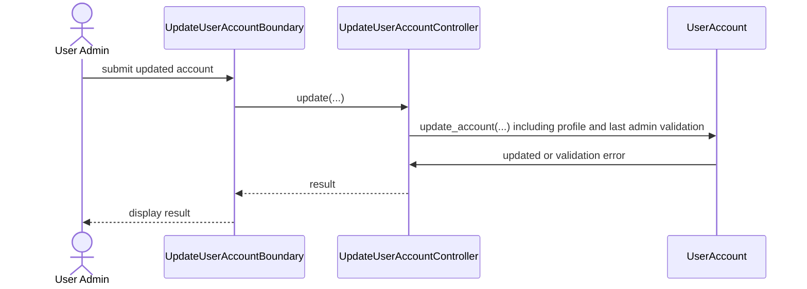

# User Story 8: Update User Account

## BCE Diagram

```mermaid
flowchart LR
    N0["Actor<br/>User Admin"]
    N1["&lt;&lt;boundary&gt;&gt;<br/>UpdateUserAccountBoundary<br/><br/>+submit()"]
    N2["&lt;&lt;control&gt;&gt;<br/>UpdateUserAccountController<br/><br/>+update()"]
    N3["&lt;&lt;entity&gt;&gt;<br/>UserAccount<br/><br/>+update_account(account_id, display_name, email, profile_id)"]
    N0 -->|"submit updated account"| N1
    N1 -->|"update(...)"| N2
    N2 -->|"update_account(...) including profile and last admin validation"| N3
    N3 -->|"updated or validation error"| N2
    N2 -->|"result"| N1
```

## Sequence Diagram

```mermaid
sequenceDiagram
    actor P0 as User Admin
    participant P1 as UpdateUserAccountBoundary
    participant P2 as UpdateUserAccountController
    participant P3 as UserAccount
    P0->>P1: submit updated account
    P1->>P2: update(...)
    P2->>P3: update_account(...) including profile and last admin validation
    P3->>P2: updated or validation error
    P2-->>P1: result
    P1-->>P0: display result
```
