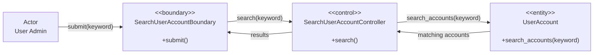
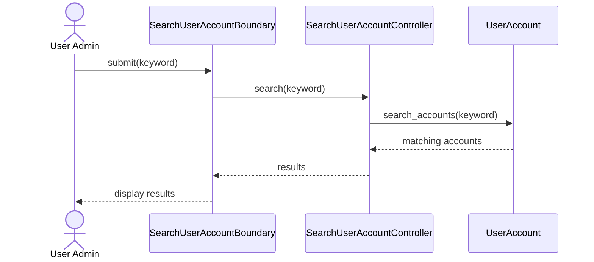

# User Story 10: Search User Accounts

## BCE Diagram

```mermaid
flowchart LR
    N0["Actor<br/>User Admin"]
    N1["&lt;&lt;boundary&gt;&gt;<br/>SearchUserAccountBoundary<br/><br/>+submit()"]
    N2["&lt;&lt;control&gt;&gt;<br/>SearchUserAccountController<br/><br/>+search()"]
    N3["&lt;&lt;entity&gt;&gt;<br/>UserAccount<br/><br/>+search_accounts(keyword)"]
    N0 -->|"submit(keyword)"| N1
    N1 -->|"search(keyword)"| N2
    N2 -->|"search_accounts(keyword)"| N3
    N3 -->|"matching accounts"| N2
    N2 -->|"results"| N1
```

## Sequence Diagram

```mermaid
sequenceDiagram
    actor P0 as User Admin
    participant P1 as SearchUserAccountBoundary
    participant P2 as SearchUserAccountController
    participant P3 as UserAccount
    P0->>P1: submit(keyword)
    P1->>P2: search(keyword)
    P2->>P3: search_accounts(keyword)
    P3-->>P2: matching accounts
    P2-->>P1: results
    P1-->>P0: display results
```
