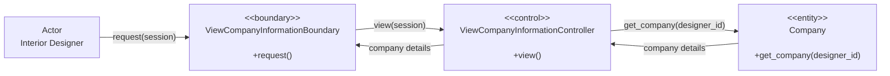
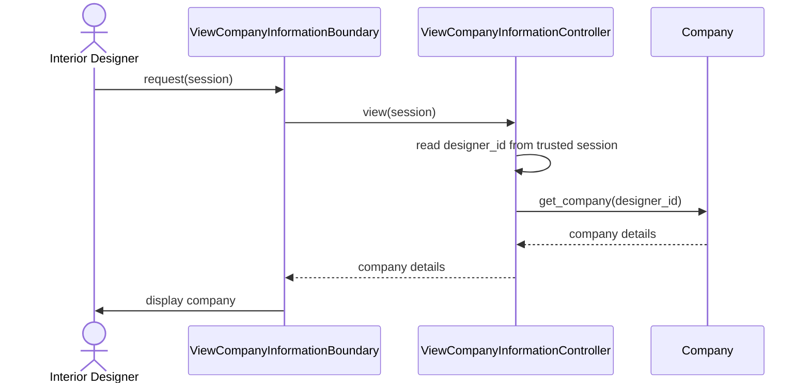

# User Story 14: View Company Information

## BCE Diagram

```mermaid
flowchart LR
    N0["Actor<br/>Interior Designer"]
    N1["&lt;&lt;boundary&gt;&gt;<br/>ViewCompanyInformationBoundary<br/><br/>+request()"]
    N2["&lt;&lt;control&gt;&gt;<br/>ViewCompanyInformationController<br/><br/>+view()"]
    N3["&lt;&lt;entity&gt;&gt;<br/>Company<br/><br/>+get_company(designer_id)"]
    N0 -->|"request(session)"| N1
    N1 -->|"view(session)"| N2
    N2 -->|"get_company(designer_id)"| N3
    N3 -->|"company details"| N2
    N2 -->|"company details"| N1
```

## Sequence Diagram

```mermaid
sequenceDiagram
    actor P0 as Interior Designer
    participant P1 as ViewCompanyInformationBoundary
    participant P2 as ViewCompanyInformationController
    participant P3 as Company
    P0->>P1: request(session)
    P1->>P2: view(session)
    P2->>P2: read designer_id from trusted session
    P2->>P3: get_company(designer_id)
    P3-->>P2: company details
    P2-->>P1: company details
    P1->>P0: display company
```
