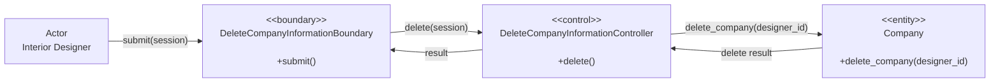
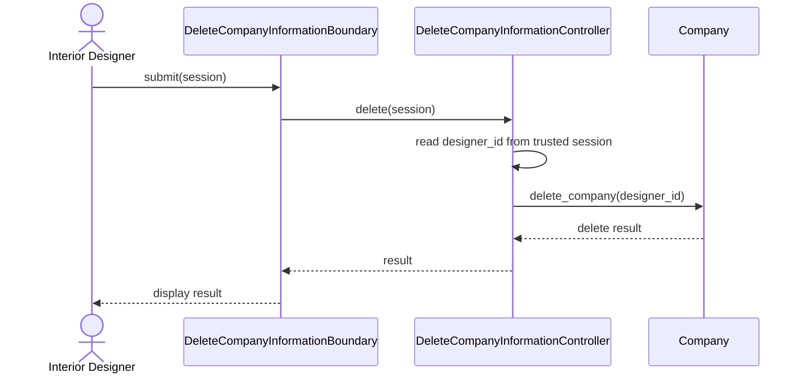

# User Story 16: Delete Company Information

## BCE Diagram

```mermaid
flowchart LR
    N0["Actor<br/>Interior Designer"]
    N1["&lt;&lt;boundary&gt;&gt;<br/>DeleteCompanyInformationBoundary<br/><br/>+submit()"]
    N2["&lt;&lt;control&gt;&gt;<br/>DeleteCompanyInformationController<br/><br/>+delete()"]
    N3["&lt;&lt;entity&gt;&gt;<br/>Company<br/><br/>+delete_company(designer_id)"]
    N0 -->|"submit(session)"| N1
    N1 -->|"delete(session)"| N2
    N2 -->|"delete_company(designer_id)"| N3
    N3 -->|"delete result"| N2
    N2 -->|"result"| N1
```

## Sequence Diagram

```mermaid
sequenceDiagram
    actor P0 as Interior Designer
    participant P1 as DeleteCompanyInformationBoundary
    participant P2 as DeleteCompanyInformationController
    participant P3 as Company
    P0->>P1: submit(session)
    P1->>P2: delete(session)
    P2->>P2: read designer_id from trusted session
    P2->>P3: delete_company(designer_id)
    P3-->>P2: delete result
    P2-->>P1: result
    P1-->>P0: display result
```
