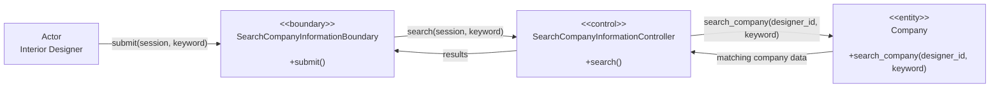
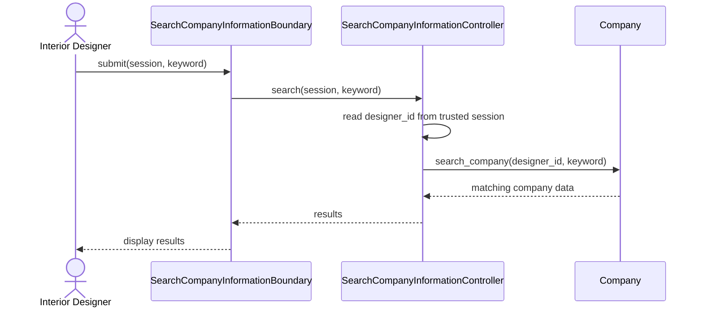

# User Story 17: Search Company Information

## BCE Diagram

```mermaid
flowchart LR
    N0["Actor<br/>Interior Designer"]
    N1["&lt;&lt;boundary&gt;&gt;<br/>SearchCompanyInformationBoundary<br/><br/>+submit()"]
    N2["&lt;&lt;control&gt;&gt;<br/>SearchCompanyInformationController<br/><br/>+search()"]
    N3["&lt;&lt;entity&gt;&gt;<br/>Company<br/><br/>+search_company(designer_id, keyword)"]
    N0 -->|"submit(session, keyword)"| N1
    N1 -->|"search(session, keyword)"| N2
    N2 -->|"search_company(designer_id, keyword)"| N3
    N3 -->|"matching company data"| N2
    N2 -->|"results"| N1
```

## Sequence Diagram

```mermaid
sequenceDiagram
    actor P0 as Interior Designer
    participant P1 as SearchCompanyInformationBoundary
    participant P2 as SearchCompanyInformationController
    participant P3 as Company
    P0->>P1: submit(session, keyword)
    P1->>P2: search(session, keyword)
    P2->>P2: read designer_id from trusted session
    P2->>P3: search_company(designer_id, keyword)
    P3-->>P2: matching company data
    P2-->>P1: results
    P1-->>P0: display results
```
