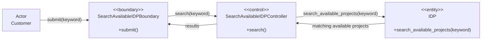
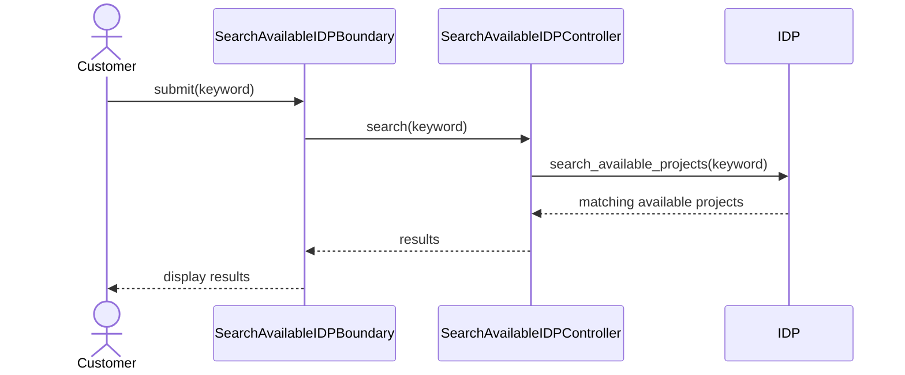

# User Story 30: Search Available IDPs

## BCE Diagram

```mermaid
flowchart LR
    N0["Actor<br/>Customer"]
    N1["&lt;&lt;boundary&gt;&gt;<br/>SearchAvailableIDPBoundary<br/><br/>+submit()"]
    N2["&lt;&lt;control&gt;&gt;<br/>SearchAvailableIDPController<br/><br/>+search()"]
    N3["&lt;&lt;entity&gt;&gt;<br/>IDP<br/><br/>+search_available_projects(keyword)"]
    N0 -->|"submit(keyword)"| N1
    N1 -->|"search(keyword)"| N2
    N2 -->|"search_available_projects(keyword)"| N3
    N3 -->|"matching available projects"| N2
    N2 -->|"results"| N1
```

## Sequence Diagram

```mermaid
sequenceDiagram
    actor P0 as Customer
    participant P1 as SearchAvailableIDPBoundary
    participant P2 as SearchAvailableIDPController
    participant P3 as IDP
    P0->>P1: submit(keyword)
    P1->>P2: search(keyword)
    P2->>P3: search_available_projects(keyword)
    P3-->>P2: matching available projects
    P2-->>P1: results
    P1-->>P0: display results
```
