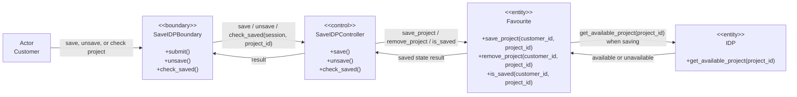
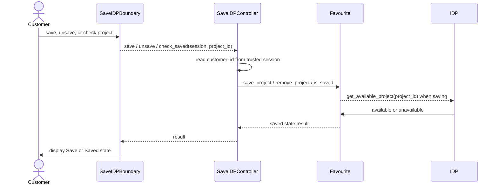

# User Story 32: Save or Unsave IDP

## BCE Diagram

```mermaid
flowchart LR
    N0["Actor<br/>Customer"]
    N1["&lt;&lt;boundary&gt;&gt;<br/>SaveIDPBoundary<br/><br/>+submit()<br/>+unsave()<br/>+check_saved()"]
    N2["&lt;&lt;control&gt;&gt;<br/>SaveIDPController<br/><br/>+save()<br/>+unsave()<br/>+check_saved()"]
    N3["&lt;&lt;entity&gt;&gt;<br/>Favourite<br/><br/>+save_project(customer_id, project_id)<br/>+remove_project(customer_id, project_id)<br/>+is_saved(customer_id, project_id)"]
    N4["&lt;&lt;entity&gt;&gt;<br/>IDP<br/><br/>+get_available_project(project_id)"]
    N0 -->|"save, unsave, or check project"| N1
    N1 -->|"save / unsave / check_saved(session, project_id)"| N2
    N2 -->|"save_project / remove_project / is_saved"| N3
    N3 -->|"get_available_project(project_id) when saving"| N4
    N4 -->|"available or unavailable"| N3
    N3 -->|"saved state result"| N2
    N2 -->|"result"| N1
```

## Sequence Diagram

```mermaid
sequenceDiagram
    actor P0 as Customer
    participant P1 as SaveIDPBoundary
    participant P2 as SaveIDPController
    participant P3 as Favourite
    participant P4 as IDP
    P0->>P1: save, unsave, or check project
    P1-->>P2: save / unsave / check_saved(session, project_id)
    P2->>P2: read customer_id from trusted session
    P2->>P3: save_project / remove_project / is_saved
    P3-->>P4: get_available_project(project_id) when saving
    P4->>P3: available or unavailable
    P3-->>P2: saved state result
    P2-->>P1: result
    P1->>P0: display Save or Saved state
```
