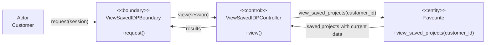
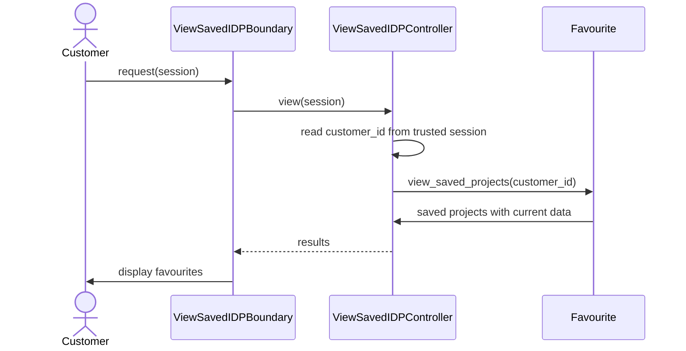

# User Story 34: View Saved IDPs

## BCE Diagram

```mermaid
flowchart LR
    N0["Actor<br/>Customer"]
    N1["&lt;&lt;boundary&gt;&gt;<br/>ViewSavedIDPBoundary<br/><br/>+request()"]
    N2["&lt;&lt;control&gt;&gt;<br/>ViewSavedIDPController<br/><br/>+view()"]
    N3["&lt;&lt;entity&gt;&gt;<br/>Favourite<br/><br/>+view_saved_projects(customer_id)"]
    N0 -->|"request(session)"| N1
    N1 -->|"view(session)"| N2
    N2 -->|"view_saved_projects(customer_id)"| N3
    N3 -->|"saved projects with current data"| N2
    N2 -->|"results"| N1
```

## Sequence Diagram

```mermaid
sequenceDiagram
    actor P0 as Customer
    participant P1 as ViewSavedIDPBoundary
    participant P2 as ViewSavedIDPController
    participant P3 as Favourite
    P0->>P1: request(session)
    P1->>P2: view(session)
    P2->>P2: read customer_id from trusted session
    P2->>P3: view_saved_projects(customer_id)
    P3->>P2: saved projects with current data
    P2-->>P1: results
    P1->>P0: display favourites
```
