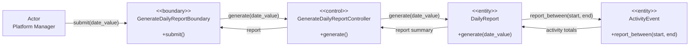
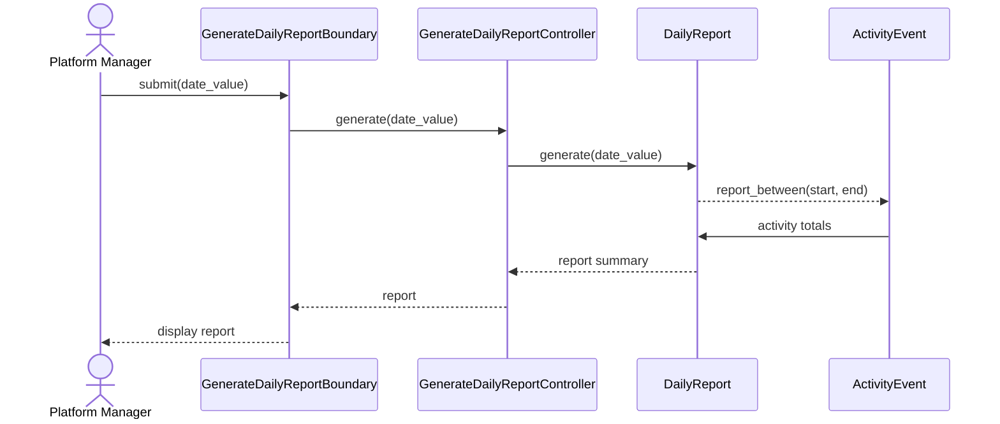

# User Story 44: Generate Daily Report

## BCE Diagram

```mermaid
flowchart LR
    N0["Actor<br/>Platform Manager"]
    N1["&lt;&lt;boundary&gt;&gt;<br/>GenerateDailyReportBoundary<br/><br/>+submit()"]
    N2["&lt;&lt;control&gt;&gt;<br/>GenerateDailyReportController<br/><br/>+generate()"]
    N3["&lt;&lt;entity&gt;&gt;<br/>DailyReport<br/><br/>+generate(date_value)"]
    N4["&lt;&lt;entity&gt;&gt;<br/>ActivityEvent<br/><br/>+report_between(start, end)"]
    N0 -->|"submit(date_value)"| N1
    N1 -->|"generate(date_value)"| N2
    N2 -->|"generate(date_value)"| N3
    N3 -->|"report_between(start, end)"| N4
    N4 -->|"activity totals"| N3
    N3 -->|"report summary"| N2
    N2 -->|"report"| N1
```

## Sequence Diagram

```mermaid
sequenceDiagram
    actor P0 as Platform Manager
    participant P1 as GenerateDailyReportBoundary
    participant P2 as GenerateDailyReportController
    participant P3 as DailyReport
    participant P4 as ActivityEvent
    P0->>P1: submit(date_value)
    P1->>P2: generate(date_value)
    P2->>P3: generate(date_value)
    P3-->>P4: report_between(start, end)
    P4->>P3: activity totals
    P3-->>P2: report summary
    P2-->>P1: report
    P1-->>P0: display report
```
