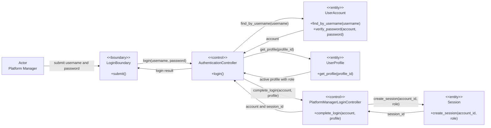
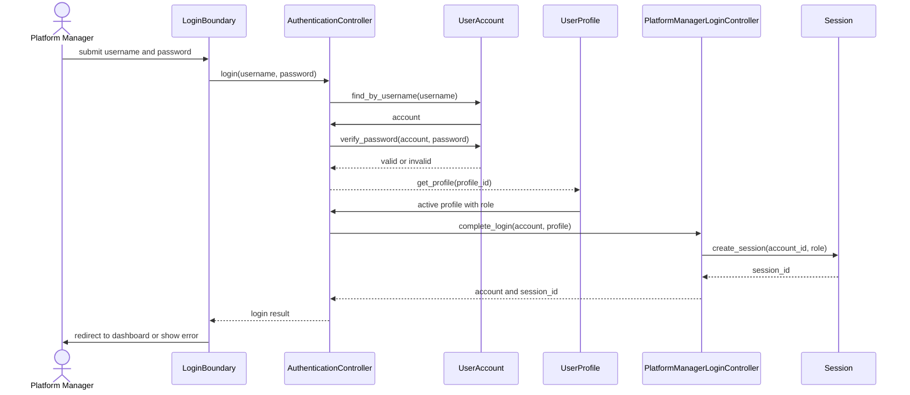

# User Story 47: Platform Manager Login

## BCE Diagram

```mermaid
flowchart LR
    N0["Actor<br/>Platform Manager"]
    N1["&lt;&lt;boundary&gt;&gt;<br/>LoginBoundary<br/><br/>+submit()"]
    N2["&lt;&lt;control&gt;&gt;<br/>AuthenticationController<br/><br/>+login()"]
    N3["&lt;&lt;entity&gt;&gt;<br/>UserAccount<br/><br/>+find_by_username(username)<br/>+verify_password(account, password)"]
    N4["&lt;&lt;entity&gt;&gt;<br/>UserProfile<br/><br/>+get_profile(profile_id)"]
    N5["&lt;&lt;control&gt;&gt;<br/>PlatformManagerLoginController<br/><br/>+complete_login(account, profile)"]
    N6["&lt;&lt;entity&gt;&gt;<br/>Session<br/><br/>+create_session(account_id, role)"]
    N0 -->|"submit username and password"| N1
    N1 -->|"login(username, password)"| N2
    N2 -->|"find_by_username(username)"| N3
    N3 -->|"account"| N2
    N2 -->|"get_profile(profile_id)"| N4
    N4 -->|"active profile with role"| N2
    N2 -->|"complete_login(account, profile)"| N5
    N5 -->|"create_session(account_id, role)"| N6
    N6 -->|"session_id"| N5
    N5 -->|"account and session_id"| N2
    N2 -->|"login result"| N1
```

## Sequence Diagram

```mermaid
sequenceDiagram
    actor P0 as Platform Manager
    participant P1 as LoginBoundary
    participant P2 as AuthenticationController
    participant P3 as UserAccount
    participant P4 as UserProfile
    participant P5 as PlatformManagerLoginController
    participant P6 as Session
    P0->>P1: submit username and password
    P1->>P2: login(username, password)
    P2->>P3: find_by_username(username)
    P3->>P2: account
    P2->>P3: verify_password(account, password)
    P3-->>P2: valid or invalid
    P2-->>P4: get_profile(profile_id)
    P4->>P2: active profile with role
    P2->>P5: complete_login(account, profile)
    P5->>P6: create_session(account_id, role)
    P6-->>P5: session_id
    P5-->>P2: account and session_id
    P2-->>P1: login result
    P1->>P0: redirect to dashboard or show error
```
